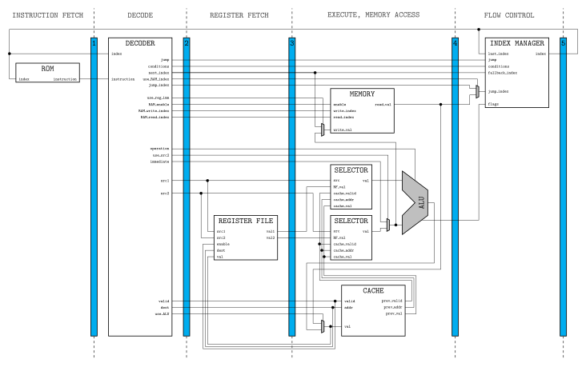

# CPU

A pipelined CPU with bypassing, and an assembler for it.

## CPU structure

See `doc.pdf` after running `make doc`, or the above `doc.svg`.

## Assembler and testing

Run `make asb` to compile the assembler, then run `./asb <filename>` to assemble
a program. `test.asb` is provided for testing purposes.

## Sizes

* RF: 2^4 = 16 registers of 16 bits
* ROM: 2^12 instructions of 26 bits
* RAM: 2^12 memory cells of 16 bits

## ISA

### Formats

    00: fmt[2] op[4] dest[4] src1[4] funct[2] [6] src2[4]
    01: fmt[2] op[4] dest[4] src1[4] funct[2] imm[10]
    10: fmt[2] op[4] dest[4] imm[16]

### Reserved instructions

    op      fmt     description (in ascending order of funct if fmt == 0.)
    0000    0.      not, and, or, xor
    0001    0.      rls, lls
    0010    0.      add, sub, mul
    0011    0.      pop, read, push
    0100    10      jmp
    0101    ..      mov
    0110    10      call
    0111    ..      ret

pseudo-instructions: inc, dec, beq, bne, bgt, bge, blt, ble
