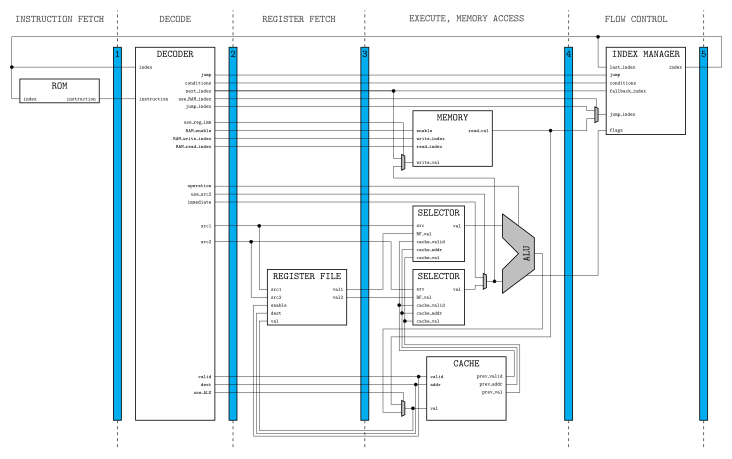

# CPU

A pipelined CPU with bypassing, and an assembler for it.

## CPU structure

See `doc.pdf` after running `make doc`, or the above `doc.svg`. Some details are
omitted for clarity:
* connections to the clock tree and the reset signal
* bus sizes
* occasionnal bus resize operations

## Assembler and testing

Run `make asb` to compile the assembler, then run `./asb <filename>` to assemble
a program. `test.asb` is provided for testing purposes.

## Sizes

* RF: 2^4 = 16 registers of 16 bits
* ROM: 2^12 instructions of 26 bits
* RAM: 2^12 memory cells of 16 bits

## ISA

### Formats, opcode encoding

While most instructions need several small operands (src1 and src2/short
immediate), a few of them need just one but full-size operand. To shorten the
general instruction length, opcodes are encoded in two parts: the op field,
common to all formats, and a funct field, for more operations granularity when
working with small operands but inexistant when space is needed for big
operands.

    FMT     FIELDS[LENGTH]
    00      fmt[2] op[4] dest[4] src1[4] funct[2] [6] src2[4]
    01      fmt[2] op[4] dest[4] src1[4] funct[2] imm[10]
    10      fmt[2] op[4] dest[4] imm[16]

That gives several instructions types:

    TYPE    COMMENT
    A       need funct, fmt = 00 or 01
    B       need full-size immediate, fmt = 10
    C       others, fmt = 00 or 10

### Reserved opcodes and mnemonics

    OP      TYPE    FUNCT   MNEMONIC    COMMENT
    0000    A                           bitwise operations
                    00      not
                    01      and
                    10      or
                    11      xor
    0001    A                           shift operations
                    00      rls
                    01      lls
    0010    A                           arithmetic operations
                    00      add
                    01      sub
                    10      mul
    0011    A                           stack manipulation
                    00      pop
                    01      read
                    10      push
    0100    B               jmp
    0101    C               mov
    0110    B               call
    0111    C               ret

Pseudo-instructions understood by the assembler:
* inc, dec
* beq, bne, bgt, bge, blt, ble

### [un]conditionnal jumps

For compactness, conditionnal and unconditionnal jumps are encoded with the
same instruction (op = 0100). More precisely, all jumps are conditionnal, with
the condition being trivially true for "unconditionnal" jumps.

Conditions are encoded as a bit mask in the dest field. It can be seen as an
array of recquirements flags. For example, 0000 corresponds to the absence of
recquirements (unconditionnal jump), while 0110 recquires both "non equal" and
"greater than or equal" comparisons, meaning "stricly greater than" and used
with the pseudo-instruction "bgt" (branch greater than).

This thinking process is to be handled by the assembler, not the user, thanks to
the set of conditionnal jump pseudo-instructions (beq, bne, bgt, bge, blt, ble)
and the unconditionnal jump instruction jmp.

### read

The read instruction (op = 0011, funct = 01) read a value in the stack at an
arbitrary depth, specified in the immediate field or stored in the src2
register, without modifying the stack. It is helpful for function calls: push
parameters on the stack and read them when needed (the compiler know the stack
state and thus can compute at compile time the depth of each parameter at any
moment).
